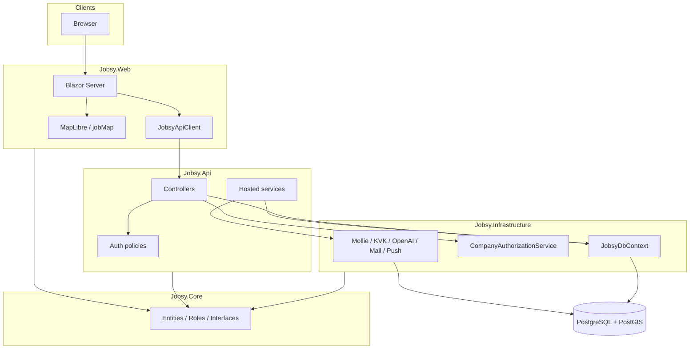

# Architecture — Lobsy / Jobsy

User-facing product name: **Lobsy**. Code, DB, packages, and repo: **Jobsy** ([ADR 0001](adr/0001-keep-jobsy-code-name.md)).

## Projects and dependencies

```
Jobsy.Core          entities, enums, interfaces, JobsyRoles / JobsyPolicies
       ↑
Jobsy.Infrastructure   EF Core (JobsyDbContext), seeders, external clients, background jobs
       ↑
Jobsy.Api           ASP.NET Core controllers + JWT / API-key auth

Jobsy.Web  → Jobsy.Core only (project reference)
           → talks to Jobsy.Api over HTTP via JobsyApiClient (+ cookie session on Web)
```

| Project | Responsibility |
|---------|----------------|
| `Jobsy.Core` | Domain model, authorization constants, contracts/interfaces — no EF, no HTTP |
| `Jobsy.Infrastructure` | Persistence, Mollie/KVK/OpenAI/mail/push, `CompanyAuthorizationService`, hosted workers |
| `Jobsy.Api` | Thin HTTP surface; policies; rate limits; Swagger (non-prod) |
| `Jobsy.Web` | Blazor Server UI, cookie auth, MFA UX, MapLibre banenkaart |
| `Jobsy.Tests` | xUnit + WebApplicationFactory + Playwright + source guards |

**Runtime:** .NET 10 LTS (`net10.0`) for all projects; EF Core / Npgsql 10.x.

New business logic belongs in **services**, not fat controllers ([ADR 0002](adr/0002-thin-controllers.md)). DTOs are currently mirrored between Api and Web ([ADR 0003](adr/0003-api-contracts.md)).

## Auth flow

```mermaid
sequenceDiagram
    participant Browser
    participant Web as Jobsy.Web
    participant Api as Jobsy.Api
    participant Db as PostgreSQL

    Browser->>Web: Login (local / Entra / Google)
    Web->>Api: Credential / external provision
    Api->>Db: Validate user + roles
    alt Local password + MFA required / enrolled
        Api-->>Web: MfaChallengeToken (LocalPassword)
        alt Not enrolled
            Web->>Browser: /account/mfa/setup (QR + TOTP)
        else Enrolled
            Web->>Browser: /account/mfa (TOTP / recovery)
        end
        Browser->>Web: MFA code
        Web->>Api: MFA verify
        opt First enrollment
            Web->>Browser: /account/mfa/recovery-codes (once)
        end
    else External IdP (entra/google/…)
        Note over Api,Web: Skip Lobsy MFA; auth_method=external:{provider}
    end
    Api-->>Web: Access profile + JWT claims material
    Web->>Browser: Auth cookie (Jobsy cookie scheme)
    Browser->>Web: Page / interactive circuit
    Web->>Api: JobsyApiClient + Bearer JWT (and internal headers)
    Api-->>Web: JSON (scoped by role + company)
```

- **Web:** cookie authentication (`CookieAuthenticationDefaults`), optional demo-login only in Development, MFA cookies `Jobsy.MfaChallenge` / `Jobsy.MfaReturnUrl` / one-time `Jobsy.MfaRecoveryCodes`, enforcement middleware for privileged **local** sessions (`auth_method` not `external*`). Pages under `/account/mfa*` are static SSR (`[ExcludeFromInteractiveRouting]`).
- **API:** JWT Bearer (`JobsyJwtScheme`) may carry `mfa_verified` and `auth_method` from the Web cookie session; API-key policy for selected integrations; FallbackPolicy deny-by-default on API.
- **Mixed-account rule:** Lobsy 2FA applies only to the sign-in method used — password → TOTP (enroll if needed); IdP → skip. See [ADR 0005](adr/0005-mfa-local-only.md).
- **Roles:** claim values from `JobsyRoles` / `UserRole` ([ADR 0004](adr/0004-roles-and-scope.md)).

## Authorization

- Policy names: `JobsyPolicies` (`RequireAdmin`, `RequireEmployer`, `RequireCandidate`, …) registered in `Jobsy.Api/Authorization/AuthorizationExtensions.cs`.
- Role helpers: `JobsyRoles` — notably `EmployerMutateRoles` **excludes** `RegionalManager` (read-only employer UI/API).
- Company / branch / org scope: `CompanyAuthorizationService` (`GetAccessibleCompanyIdsAsync`, `CanAccessCompanyAsync`). Scope is membership-driven today; see [`docs/security/roles-matrix.md`](security/roles-matrix.md).
- Blazor pages use `@attribute [Authorize(Roles=…)]` / `[AllowAnonymous]`; Web has **no** FallbackPolicy — unannotated pages are reachable (document carefully when adding pages).

## Static assets and bundles

- Versioned assets under `Jobsy.Web/wwwroot` use `?v=` query tags (immutable long-cache).
- Guard: `Jobsy.Tests/AssetVersionGuardTests` + manifest `Jobsy.Tests/asset-versions.json`.
- After changing a versioned file: bump `?v=` in `App.razor` / loaders (`maps-loader.js`, `app-core.js`, …), then `python3 Jobsy.Tests/update-asset-versions.py`.
- CSS: editable source `wwwroot/css/app.css` (and `css/features/*`); served `app.min.css` is a hand-maintained mirror **until** cleanup prompt 10 lands a real minifier — do not edit `app.min.css` alone out of sync (see `CONTRIBUTING.md`).
- Map JS: `jobMap.js` → served `jobMap.min.js`; MapLibre CSP build under `wwwroot/lib/maplibre/`.

## Background jobs

Hosted services (API / Infrastructure) include (non-exhaustive):

- `DatabaseSeedHostedService` — migrate + seed off the request thread
- `DataRetentionHostedService` — AVG retention
- `TokenCheckoutReconcileHostedService`, `VatBufferTransferHostedService`
- `AtsScrapeHostedService`, `AtsVacancyHealthHostedService`
- `VacancyDiscoveryIndexHostedService`, `DashboardCacheRefreshHostedService`
- `CultureFitRefineWorker`, `CandidateInsightsWorker` (OpenAI-backed refine/insights)
- `VacancyEngagementReminderHostedService`, `CompanyReengagementHostedService`
- `DraftVacancyCleanupHostedService`, `UnconfirmedRegistrationCleanupHostedService`
- `TalentContactRefundHostedService`, `KvkVerificationRetryHostedService`
- `FeedbackAutomationPollHostedService`, `IbanEncryptionMigrationHostedService`
- `MinimumWageUpdateHostedService`, `WebPushVapidKeyProvider`

## OpenAI, push, payments

| Concern | Where |
|---------|--------|
| OpenAI | Named HttpClients + integration credentials (`IntegrationKey.OpenAI`); moderation, WhoAmI, assistant, culture-fit, deep analysis |
| Web Push | `WebPush` package + VAPID keys (`WebPush__*`); subscription endpoints under `api/push` |
| Payments | Mollie (live keys outside Development); stub payments only when `JobsyAuth:AllowStubPayments` |

## Diagram (solution)



## Occupation catalogue

Candidates see jobs from one generated catalogue, not from a hand-written list.

1. `python3 tools/occupations/fetch.py` downloads the pinned sources into `tools/occupations/.cache/` (gitignored): ESCO v1.2.1 Dutch, the ESCO–O*NET crosswalk, O*NET 31.0 interest files, and the CBS BRC 2014 editie 2025 workbook. Pins and sha256 values are in `tools/occupations/sources.json`.
2. `python3 tools/occupations/build_catalog.py` writes `Jobsy.Core/Data/Occupations/*.json`. Those files are embedded and committed. The .NET build does not use the network.
3. `python3 tools/occupations/build_catalog.py --check` rebuilds in a temp directory and fails if the committed JSON changed. It ignores `generatorCommit`. It needs the cache from step 1. A manual GitHub Action `Occupation catalogue check` runs fetch + `--check`. It is `workflow_dispatch` only.

`corrections.json` stores O*NET codes, never interest numbers. A row applies only when its status is `goedgekeurd`. Concept and rejected rows do not change the committed profiles. Approving a row is a data change: set the status, fill `approvedBy` and `approvedOn`, rerun the build, commit. `Occupations:PreviewConceptCorrections` can apply concept rows outside Production. Production ignores that flag.

Update the pins in September, after the O*NET August release. Take a new ESCO version when one is published.

The same `CareerCompassSnapshot` (keyed by ESCO id) feeds the report, the coach, the action plan, `/carriere` and the role-fit check. The model may pick a job from that snapshot. It does not invent a title or a percentage.

## Related docs

- Onboarding / secrets: [`ONBOARDING.md`](ONBOARDING.md)
- Routes catalog: [`ROUTES.md`](ROUTES.md)
- Roles: [`security/roles-matrix.md`](security/roles-matrix.md), [`../ROLES_AND_VIEWS.md`](../ROLES_AND_VIEWS.md)
- Security / AVG: [`../SECURITY.md`](../SECURITY.md)
- Deploy: [`deploy-render.md`](deploy-render.md), [`release-flow.md`](release-flow.md)
