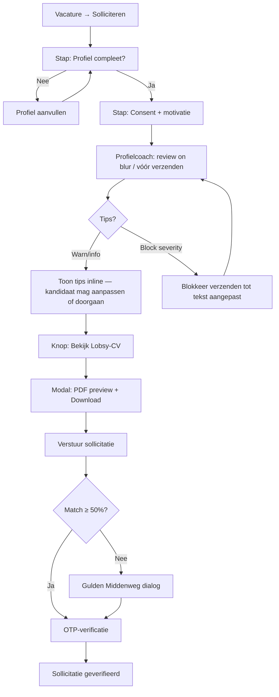

# Functionele & technische specificatie: Lobsy-CV preview, PDF-vrijgave & AI-profielcoach

**Status:** deels geïmplementeerd (live PDF-preview + download; werkgever na Accept)  
**Scope:** sollicitatieproces (kandidaat + werkgever)  
**AVG-anker:** `SECURITY.md` §B — progressive disclosure tot Accept  
**Bestaande bouwstenen:** `ApplicationsController` (PiiRevealed), QuestPDF-flyers, `VacancyContentModerationService` (OpenAI + heuristics), apply-flow in `VacancyDetail.razor`, `/branch/applicants`

---

## 0. Doelen

1. **Voorbeeld-PDF inzicht** — De werkzoekende ziet/downloadt vóór verzenden precies welk automatisch Lobsy-CV bij de sollicitatie hoort. Controle → lagere drempel.
2. **Beveiligde PDF-workflow** — Het Lobsy-CV (PDF) is voor werkgevers (intermediair, bedrijfs-/vestigingsmanager) **pas zichtbaar na expliciete Accept**. Tot die tijd: geen PDF-endpoint, geen snapshot-lek via API.
3. **Lichte AI-moderatie / profielcoach** — Directe, actiegerichte tips op profiel + motivatie (spelling/taal, te korte/lege velden, match-verbeteringen zoals beschikbaarheid). Soft gate: tips blokkeren verzenden niet hard (tenzij harde contentpolicy); kandidaat blijft in control.

---

## 1. Domeinmodel & begrippen

| Begrip | Betekenis |
|--------|-----------|
| **Lobsy-CV** | Server-gegenereerde PDF uit kandidaatprofiel + sollicitatie-snapshot (geen upload-CV). |
| **Preview-PDF** | Zelfde layout als werkgevers-PDF, gegenereerd uit *live* of *draft*-profiel; alleen voor de kandidaat zelf. |
| **Released CV** | PDF gebaseerd op **bevroren snapshots** van de Application; alleen na `Accepted` / `EmployerContacting` / `Hired`. |
| **Profielcoach** | Deterministische checks + optionele LLM-tips; feature-flagged. |
| **PiiRevealed** | Bestaande vlag in `EmployerApplicationDto`: `true` bij Accepted / EmployerContacting / Hired. |

### 1.1 Wat staat er in het Lobsy-CV?

Canonieke secties (NL; EN/PL/RO/AR via bestaande localization later):

1. **Kop** — Lobsy-merk + “Lobsy-CV” + generatiedatum  
2. **Persoon** — naam, woonplaats (geen volledige straat in preview naar derden; wel in released CV na Accept)  
3. **Over mij** — `AboutMe` / `SnapshotAboutMe`  
4. **Motivatie** — optioneel `Application.Motivation` (alleen als ingevuld bij deze vacature)  
5. **Beschikbaarheid** — uren min/max, dagdelen / “tijden in overleg”  
6. **Vervoer & reistijd** — preferred transport + estimated minutes (vacature-specifiek)  
7. **Rijbewijs / opleiding / werkervaring** — snapshot-lijsten + employer count  
8. **Match-context (werkgever)** — match-% + korte breakdown (niet in kandidaat-preview verplicht; wel na Accept handig)  
9. **Footer** — “Gegenereerd door Lobsy · niet door de kandidaat geüpload” + consentversie

**Niet in PDF:** BSN, IBAN, wachtwoorden, OTP-codes, interne redencodes Arbeidstijdenwet, volledige preferences-JSON.

### 1.2 Snapshot vs live

| Moment | Bron voor PDF |
|--------|----------------|
| Kandidaat preview vóór Apply | Live `User` + prefs + optionele draft-motivatie uit UI |
| Kandidaat herdownload na Apply | Application-snapshots + Motivation |
| Werkgever download | Alleen Application-snapshots; **alleen als PiiRevealed** |

Bij Apply blijven bestaande snapshotvelden gevuld (`SnapshotAboutMe`, availability, licenses, educations, Motivation, MatchPercent, …). PDF bevat geen aparte blob-opslag tenzij later caching nodig is (zie §5.4).

---

## 2. Autorisatie & AVG — vrijgave van de kandidaat-PDF

### 2.1 Beslisboom (server-side, single source of truth)

```
CanDownloadLobsyCvPdf(caller, application):
  1. Application bestaat én EmailVerifiedAt != null
     (drafts zonder verificatie: geen werkgevers-PDF; kandidaat mag wel live-preview)
  2. Als caller == kandidaat (CandidateUserId of geverifieerd e-mail-eigenaar):
     → ALLOW (eigen CV / eigen sollicitatie)
  3. Als caller is werkgever-rol in ApplicationReactRoles
     én company-scope bevat Vacancy.CompanyId:
       a. Status ∈ { Accepted, EmployerContacting, Hired }
          → ALLOW (PiiRevealed)
       b. anders (Pending, Rejected, FilledElsewhere, …)
          → DENY 403 (geen 404-leak van bestaan tenzij lijst al toont)
  4. Anders → DENY 403
```

**Regel:** UI-verbergen is niet genoeg. Elk PDF-endpoint herhaalt dezelfde check als `MapEmployerDto` / list-mapping (`revealed = Accepted | EmployerContacting | Hired`).

### 2.2 Progressive disclosure — wat de werkgever wél/niet ziet

| Data | Pre-Accept (Pending) | Post-Accept |
|------|----------------------|-------------|
| Match %, breakdown, ViaSafetyNet | Ja | Ja |
| Motivatie (tekst) | Ja (bestaand) | Ja |
| Reistijd / transport (niet-PII) | Ja | Ja |
| Naam, e-mail, adres, stad, afstand | Nee | Ja |
| Snapshots (AboutMe, licenses, …) | Nee | Ja |
| **Lobsy-CV PDF download/preview** | **Nee** | **Ja** |
| Knop “Download Lobsy-CV” in UI | Verborgen + disabled | Zichtbaar |

Motivatie blijft pre-accept zichtbaar als *tekst in de sollicitatiekaart* (bestaand contract). De **PDF** bundelt PII + snapshots → daarom strenger: pas na Accept.

### 2.3 Consent

- Per sollicitatie: bestaande `ConsentAcceptedAt` / `ConsentVersion` (server = `PrivacyConstants.CurrentConsentVersion`).
- Copy bij preview: *“Dit is het CV dat Lobsy na acceptatie door de werkgever deelt. Tot die tijd ziet de werkgever geen PDF en geen persoonsgegevens.”*
- Geen client-supplied consentversie accepteren (bestaande regel).

### 2.4 Logging & retention

- PlatformLogs: geen plaintext e-mail; log `applicationId` + actor role + outcome (allowed/denied).
- Geen permanente PDF-bestanden op disk tenzij tijdelijke cache met TTL (optioneel); default: on-the-fly QuestPDF.
- Right to be forgotten: bestaande anonymize wist snapshots → PDF-generatie faalt soft of toont “niet beschikbaar”.

---

## 3. API-contracten

### 3.1 Kandidaat — live preview (vóór verzenden)

```
GET /api/me/lobsy-cv.pdf
Authorization: Candidate
Query (optioneel):
  vacancyId     — voor vacature-specifieke reistijd/motivatie-context
  motivation    — niet via query (PII in URL); gebruik POST body i.p.v.

POST /api/me/lobsy-cv/preview
Body: { "vacancyId": "uuid?", "motivation": "string?" }
Response: application/pdf
```

**Aanbevolen:** `POST …/preview` zodat motivatie niet in URL/logs belandt. Rate limit: bestaande authenticated write/read policy of nieuwe `cv-preview` (bijv. 20/min per user).

### 3.2 Kandidaat — PDF van bestaande sollicitatie

```
GET /api/applications/{id}/lobsy-cv.pdf
Authorization: eigenaar-kandidaat
Preconditie: EmailVerifiedAt != null (of draft-eigenaar met live fallback — kies: verified only)
```

### 3.3 Werkgever — PDF na Accept

```
GET /api/employer/applications/{id}/lobsy-cv.pdf
Authorization: ApplicationReactRoles + company scope
Preconditie: PiiRevealed == true
Anders: 403 { "code": "cv_not_released", "message": "…" }
```

Geen aparte “release”-actie: **Accept = release**. `POST …/react` met `Accepted` is de enige vrijgave.

### 3.4 Profielcoach

```
POST /api/me/profile-coach/review
Authorization: Candidate
Body: {
  "aboutMe": "string?",
  "motivation": "string?",
  "vacancyId": "uuid?",          // voor match-tips
  "includeAvailabilityHints": true
}
Response: {
  "canProceed": true,            // false alleen bij harde policy (schelden/PII-leak)
  "scoreHint": "good|ok|weak",   // UX, geen ranking naar werkgever
  "tips": [
    {
      "code": "motivation_short",
      "severity": "info|warn|block",
      "field": "motivation|aboutMe|availability|general",
      "title": "…",
      "message": "…",            // actiegericht
      "suggestion": "…"          // optionele herschrijfhint
    }
  ]
}
```

Feature flag: `CandidateProfileCoachEnabled` (nieuw, naast `VacancyContentModerationEnabled`).  
Zonder OpenAI-key: pure heuristics (zoals `DutchVacancyModerationHeuristics`).

---

## 4. Services & lagen (Clean Architecture)

```
Jobsy.Core
  Interfaces/ILobsyCvPdfService.cs
  Interfaces/ICandidateProfileCoachService.cs
  Rules/LobsyCvAccessRules.cs          // CanCandidatePreview, CanEmployerDownload
  Rules/CandidateProfileCoachHeuristics.cs
  Dtos/ProfileCoachTip.cs

Jobsy.Infrastructure
  Services/LobsyCvPdfService.cs        // QuestPDF (zelfde stack als AmbassadeurFlyerPdfService)
  Services/CandidateProfileCoachService.cs  // heuristics → optional OpenAI JSON

Jobsy.Api
  Controllers: MeController of ApplicationsController endpoints (§3)
  Mapping: EmployerApplicationDto += CvPdfAvailable: bool (= PiiRevealed)

Jobsy.Web
  Components: LobsyCvPreviewPanel.razor
  Components: ProfileCoachTips.razor
  Pages: VacancyDetail.razor (apply step), Applicants.razor (download knop)
  Candidate/Applications.razor (herdownload)
```

### 4.1 `LobsyCvAccessRules` (kern)

```csharp
public static bool IsPiiRevealed(ApplicationStatus status)
  => status is Accepted or EmployerContacting or Hired;

public static bool CanEmployerDownloadCv(ApplicationStatus status, DateTime? emailVerifiedAt)
  => emailVerifiedAt is not null && IsPiiRevealed(status);
```

Houd synchroon met list-mapping in `ApplicationsController` (één helper, geen gedupliceerde statuslijsten).

### 4.2 PDF-generatie

- QuestPDF Community (bestaand patroon).
- Input DTO `LobsyCvModel` (geen EF-entities in Core).
- Bestandnaam: `Lobsy-CV-{InitialsOfName}-{yyyyMMdd}.pdf` (geen volledig e-mailadres in filename).
- Content-Disposition: `inline` voor preview-modal; `attachment` voor expliciete download.

---

## 5. UI/UX flows

### 5.1 Kandidaat — sollicitatie met preview + coach



#### Stap-voor-stap (kandidaat)

1. Kandidaat opent apply-flow (`VacancyDetail` apply panel).
2. Soft/hard gates zoals nu (beschikbaarheid, AboutMe, rijbewijs, …).
3. Optioneel motivatieveld (max ~500 tekens — bestaand).
4. **Debounced** `POST /profile-coach/review` bij verlaten motivatie/AboutMe of klik “Controleer mijn tekst”.
5. Tips verschijnen als compacte lijst onder het veld (geen aparte chat-thread verplicht; optioneel LobsyCoachAvatar voor warmte).
6. Secundaire CTA: **“Bekijk je Lobsy-CV”** → modal met embedded PDF (`iframe`/`object` of download-first op mobiel).
7. Primaire CTA: **“Verstuur sollicitatie”** — start bestaande Apply + OTP / Gulden Middenweg.
8. Na verify: op `/candidate/applications` knop **“Download Lobsy-CV”** per item.

**Copy (voorbeeld):**
- Preview-titel: *“Zo ziet je Lobsy-CV eruit”*
- Uitleg: *“De werkgever krijgt dit document pas te zien nadat die jouw sollicitatie accepteert.”*
- Coach leeg veld: *“Je Over mij staat nog leeg. Een paar zinnen over wat je zoekt maken je kans groter.”*
- Coach kort: *“Je motivatie is erg kort. Noem één concrete reden waarom dit werk bij je past.”*
- Coach beschikbaarheid: *“Je hebt nog geen dagdelen aangegeven. Voeg beschikbaarheden toe voor een betere match.”*

### 5.2 Werkgever — Accept = PDF-vrijgave

```mermaid
flowchart TD
  A[/branch/applicants] --> B[Kaart: match% + motivatie tekst]
  B --> C{Pending?}
  C -->|Ja| D[Geen naam/PII · geen CV-knop]
  D --> E[Accepteer / Wijs af]
  E -->|Accept| F[Status Accepted · PiiRevealed]
  F --> G[Toon PII + knop Download Lobsy-CV]
  G --> H[GET employer PDF — 200]
  E -->|Reject| I[Geen PDF ooit]
  C -->|Al Accepted+| G
```

#### Stap-voor-stap (werkgever)

1. Lijst toont pre-accept alleen niet-PII + motivatie + match (bestaand).
2. Geen CV-preview, geen verborgen link in HTML.
3. Klik **Accepteer** → `POST /api/applications/{id}/react` `{ status: Accepted }`.
4. Response DTO heeft `PiiRevealed: true` en `CvPdfAvailable: true`.
5. UI toont naam/contact + **“Download Lobsy-CV (PDF)”**.
6. Download roept employer-endpoint aan; bij race (nog Pending) → 403 met vriendelijke melding.
7. Intermediair / Branch / Regional / Enterprise: zelfde company-scope checks als React.

### 5.3 UX-principes (Lobsy)

- Eén primaire actie per stap; PDF-preview is **secundair** (controle, geen verplichting).
- Coach-tips: kort, vriendelijk, actiegericht — geen straftoon; severity `block` alleen bij policy (scheldwoorden, BSN/IBAN in tekst).
- Geen card-fest in apply-hero; tips als inline list onder velden.
- Mobiel: PDF → native download/share i.p.v. krappe iframe waar nodig.

---

## 6. AI-moderatiebot / profielcoach — logica

### 6.1 Pipeline (volgorde)

1. **Normalize** — trim, HTML strip (`HtmlSanitize`), lengte-cap.  
2. **Harde heuristics (altijd)**  
   - Leeg `AboutMe` terwijl apply-gate AboutMe vereist → `warn`/`block` afhankelijk van bestaande apply-gate (gate blijft source of truth).  
   - Motivatie lengte &lt; 20 tekens (als niet leeg) → `info` `motivation_short`.  
   - Motivatie &gt; limiet → client + server 400.  
   - Geen availability / uren → `warn` `availability_missing` (link naar profiel).  
   - Detectie BSN-achtig / IBAN-achtig / telefoon in vrije tekst → `block` `pii_in_text` (“Zet geen BSN of bankgegevens in je tekst”).  
   - Excessieve CAPS / herhaalde tekens → `info`.  
3. **Taal/spelling (licht)**  
   - Zonder LLM: eenvoudige NL wordlist / herhaalde typo-patronen (optioneel later).  
   - Met OpenAI (`gpt-4o-mini` of configured model): JSON tips alleen; **geen** volledige herschrijving tenzij user “Pas tip toe” kiest.  
4. **Match-tips (vacancyId aanwezig)**  
   - Hergebruik match-breakdown signalen: lage uren-overlap, geen dagdeel-overlap, lange reistijd → concrete tip (“Pas je max. reistijd of dagdelen aan”).  
5. **Aggregatie** — dedupe op `code`; sorteer `block` → `warn` → `info`.  
6. **canProceed** — `false` iff any `severity == block`. Soft tips blokkeren Apply niet.

### 6.2 OpenAI-prompt (schets)

Systeemrol: vriendelijke Lobsy-coach voor werkzoekenden in NL; geen discriminatie-advies; geen PII vragen; output **alleen JSON** array tips met vaste codes.  
User payload: aboutMe, motivation, vacancy title (geen werkgeverscontact), availability flags, match signals.

Fail-open voor soft tips (heuristics only); fail-closed voor vacancy-style discrimination is **niet** van toepassing op kandidatentekst — hier fail-open behalve PII-block heuristics.

### 6.3 Privacy van de coach

- LLM-calls: geen e-mail/adres/DOB meesturen.  
- Feature flag uit → alleen heuristics.  
- Geen opslag van coach-transcripten in DB (MVP); optioneel anoniem aggregate metric later.  
- Zelfde OpenAI-credential store als vacaturemoderatie.

### 6.4 Relatie tot Gulden Middenweg

Coach ≠ match-score gate. Volgorde bij verzenden:

1. Harde eisen / legal eligibility  
2. Profielcompleetheid  
3. Coach `canProceed` (PII-block)  
4. MatchScore + eventueel Gulden Middenweg dialog  
5. Apply + OTP  

---

## 7. Implementatiestappen (engineering checklist)

### Fase A — Access rules & DTO

1. Extraheer `IsPiiRevealed` naar `LobsyCvAccessRules` / `ApplicationRules`.  
2. Refactor `ApplicationsController` list + `MapEmployerDto` naar die helper.  
3. Voeg `CvPdfAvailable` toe aan `EmployerApplicationDto` (+ Web model).  
4. Tests: Pending → geen CV; Accepted → wel (uitbreiding `RoleFunctionalRegressionTests`).

### Fase B — PDF-service

1. `ILobsyCvPdfService` + QuestPDF layout.  
2. Candidate `POST /api/me/lobsy-cv/preview`.  
3. Candidate `GET /api/applications/{id}/lobsy-cv.pdf`.  
4. Employer `GET /api/employer/applications/{id}/lobsy-cv.pdf` met 403 pre-accept.  
5. Unit tests op access rules + PDF non-empty bytes.

### Fase C — UI preview

1. `LobsyCvPreviewPanel` in apply-flow + applications-lijst.  
2. Applicants: download-knop iff `CvPdfAvailable`.  
3. Localization keys NL(+EN).  
4. Mobiele download-fallback.

### Fase D — Profielcoach

1. Feature flag `CandidateProfileCoachEnabled`.  
2. Heuristics + optionele OpenAI service.  
3. Endpoint + `ProfileCoachTips` component.  
4. Wire in `VacancyDetail` vóór Apply.  
5. Tests heuristics (kort/leeg/PII/availability).

### Fase E — Docs & compliance

1. `SECURITY.md` progressive disclosure: expliciet “Lobsy-CV PDF pas na Accept”.  
2. `REQUIREMENTS.md` verwijzing naar dit document.  
3. Demo-script kandidaat + filiaalmanager bijwerken.

---

## 8. Foutafhandeling & edge cases

| Situatie | Gedrag |
|----------|--------|
| Werkgever downloadt Pending | 403 `cv_not_released` |
| Kandidaat zonder AboutMe opent preview | PDF met lege sectie + coach-tip; of soft-block preview tot minimumprofiel |
| Rejected sollicitatie | Geen employer PDF; kandidaat mag eigen PDF houden |
| FilledElsewhere | Geen employer PDF |
| Profiel gewijzigd na Apply | Employer PDF blijft snapshot; candidate “live preview” toont nieuw profiel met disclaimer |
| OpenAI down | Heuristics-only tips |
| Unverified draft | Geen employer visibility; candidate preview via `/me` wel |

---

## 9. Testplan (minimaal)

1. **Access:** BranchManager op Pending → 403 PDF; na Accept → 200 + PII in PDF.  
2. **Scope:** Manager van ander bedrijf → 403.  
3. **Candidate:** Eigen preview 200; andere user 403.  
4. **Redaction regressie:** list DTO Pending nog steeds zonder naam/snapshots.  
5. **Coach:** lege AboutMe → tip; IBAN in motivatie → block; korte motivatie → info; flag uit → lege tips / skip.  
6. **Apply flow:** preview opent zonder Apply te committen (geen Application-row).

---

## 10. Niet-doelen (MVP)

- Upload van eigen PDF-CV door kandidaat  
- Werkgever die PDF deelt buiten Lobsy (kunnen we niet technisch verhinderen na download; wel watermerk “alleen voor deze vacature”)  
- Volledige grammar-LLM in de browser  
- Moderatie-wachtrij admin voor kandidatenteksten (apart van vacaturemoderatie)

---

## 11. Samenvatting autorisatie in één zin

**De kandidaat mag het Lobsy-CV altijd van zichzelf inzien; de werkgever pas nadat `Application.Status` progressive-disclosure vrijgeeft (`Accepted` / `EmployerContacting` / `Hired`) én company-scope klopt — afgedwongen op het PDF-endpoint, niet alleen in de UI.**
