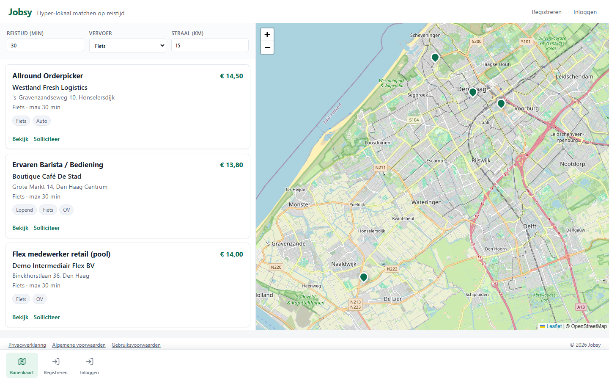
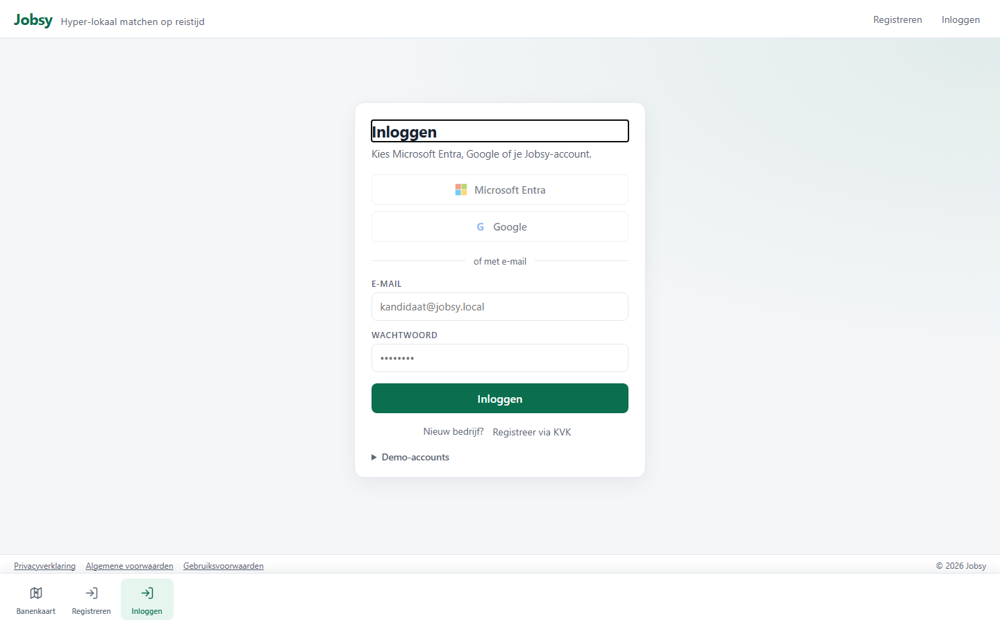

# Publiek — Banenkaart & inloggen

*Doel van dit scherm: iedereen (zonder account) kan vacatures zien op reistijd en kaart.*

## Werkbeschrijving

De publieke banenkaart is de voordeur van Jobsy. Bezoekers filteren vacatures op **reistijd**, **vervoer** (fiets, auto, OV, lopend) en **straal**, en zien resultaten in een Funda-achtige split view: lijst links, Leaflet-kaart rechts.

Zonder login kun je vacatures bekijken. Solliciteren, liken en delen vragen om een account (of doorlinken naar inloggen).

### Schermen

| Scherm | URL | Functie |
|--------|-----|---------|
| Banenkaart | `/` | Zoeken + kaart |
| Vacaturedetail | `/vacancies/{id}` | Inhoud, solliciteren (na login) |
| Inloggen | `/login` | Entra / Google / demo e-mail |
| Registreren | `/register` | Bedrijf via KVK-stub + wachtwoord; SBI 78 → Intermediair; anders Bedrijfsmanager (Organization = org, BranchOnly = vestiging-als-bedrijf; kan vestigingsmanagers uitnodigen) |

### Printscreens

*Figuur: publieke banenkaart met filters, vacaturelijst en kaartmarkers.*

*Figuur: login met demo-accounts (wachtwoord `Jobsy123!`).*

---

## Demo-script (± 2 min)

1. Open http://localhost:5201/ — toon split view lijst + kaart.  
2. Zet reistijd op 30 min, vervoer op Fiets; wijs op loon en tags per vacature.  
3. Klik **Bekijk** op een vacature → detail.  
4. Klik **Inloggen** → toon demo-accounts onderaan.  
5. Log in als gewenste rol en ga verder met het rol-specifieke demo-script.
