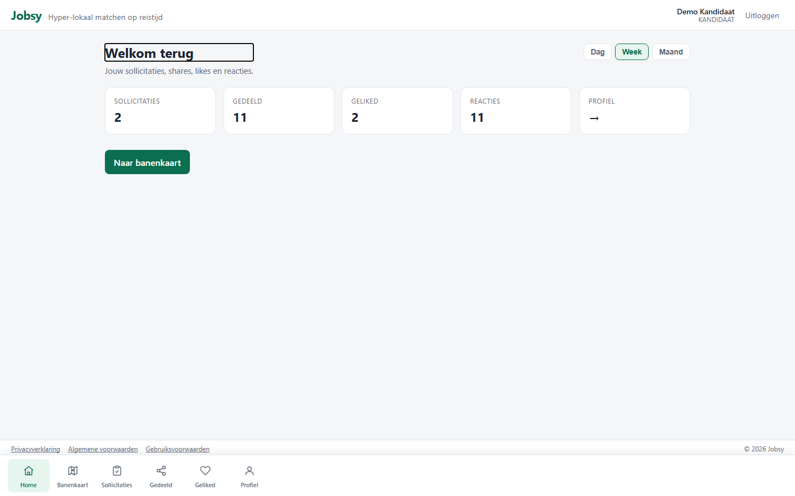
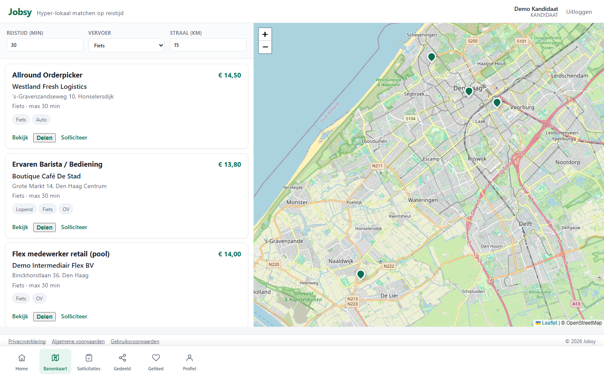
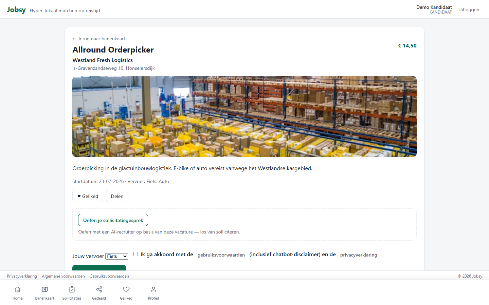
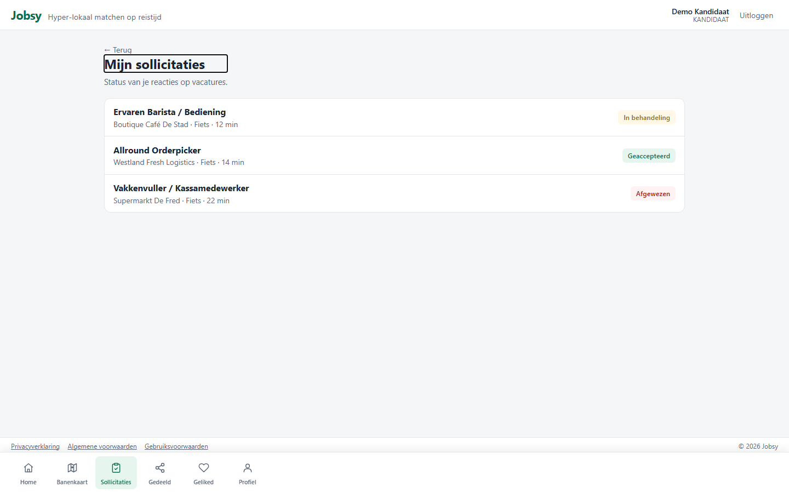
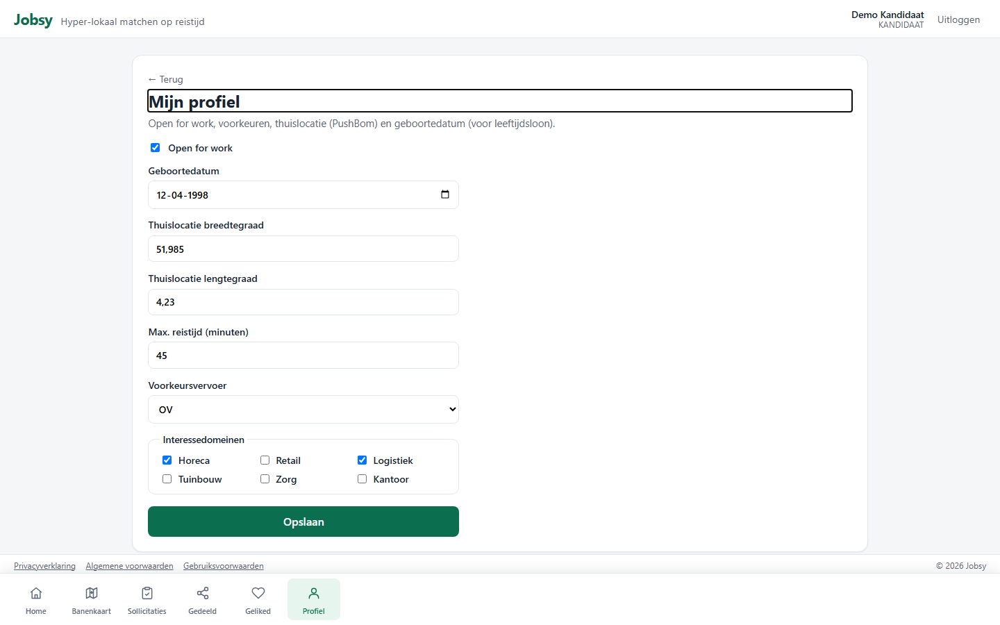

# Rol: Kandidaat

**Account:** `kandidaat@jobsy.local` / `Jobsy123!`  
**Doel:** snel een baan vinden op reistijd en vervoer, solliciteren en engagement bijhouden.

## Werkbeschrijving

De kandidaat werkt vanuit een persoonlijk dashboard en de banenkaart. Matching draait om **waar je woont** en **hoe je reist**, niet om klassieke keyword-filters.

### Kerntaken

| Taak | Waar | Toelichting |
|------|------|-------------|
| Overzicht eigen activiteit | `/home` | Sollicitaties, shares, likes, reacties (dag/week/maand) |
| Banen zoeken | `/` | Filters + kaart |
| Vacature bekijken / solliciteren | `/vacancies/{id}` | Solliciteren, like, share; optioneel mock-interview |
| Historie | `/candidate/applications` | Sollicitatiehistorie |
| Engagement | `/candidate/liked`, `/candidate/shared` | Bewaarde en gedeelde vacatures |
| Profiel | `/candidate/profile` | OpenForWork, voorkeuren, thuislocatie (PushBom) |

### Bottom-navigatie

Home · Banenkaart · Sollicitaties · Gedeeld · Geliked · Profiel

### Printscreens

*Home: KPI’s over eigen activiteit + snelle link naar banenkaart.*

*Ingelogde banenkaart met dezelfde reistijd-filters.*

*Vacaturedetail: solliciteren / like / share.*

*Sollicitatiehistorie.*

*Profiel met OpenForWork en thuislocatie.*

---

## Demo-script (± 3–4 min)

1. Log in als `kandidaat@jobsy.local`.  
2. Toon **Home**: tegels Sollicitaties / Gedeeld / Geliked / Reacties; schakel Dag ↔ Week ↔ Maand.  
3. Klik **Naar banenkaart** (of bottomnav Banenkaart).  
4. Pas vervoer of reistijd aan; wijs op markers op de kaart.  
5. Open een vacature via **Bekijk** → toon solliciteren / like / share.  
6. Ga naar **Sollicitaties** en **Profiel** (OpenForWork / thuislocatie noemen).  
7. Afronden: “De kandidaat kiest werk op reistijd, niet op postcode-radius alleen.”
