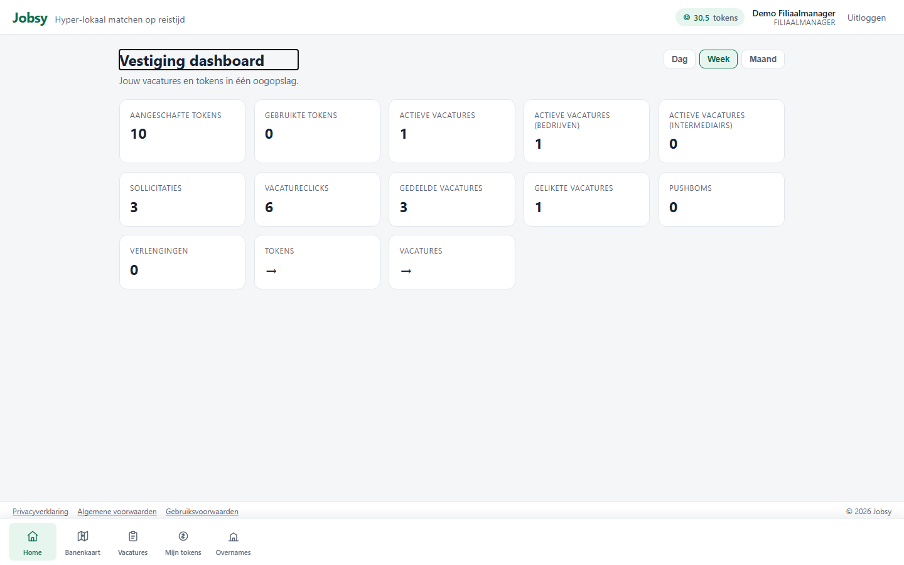
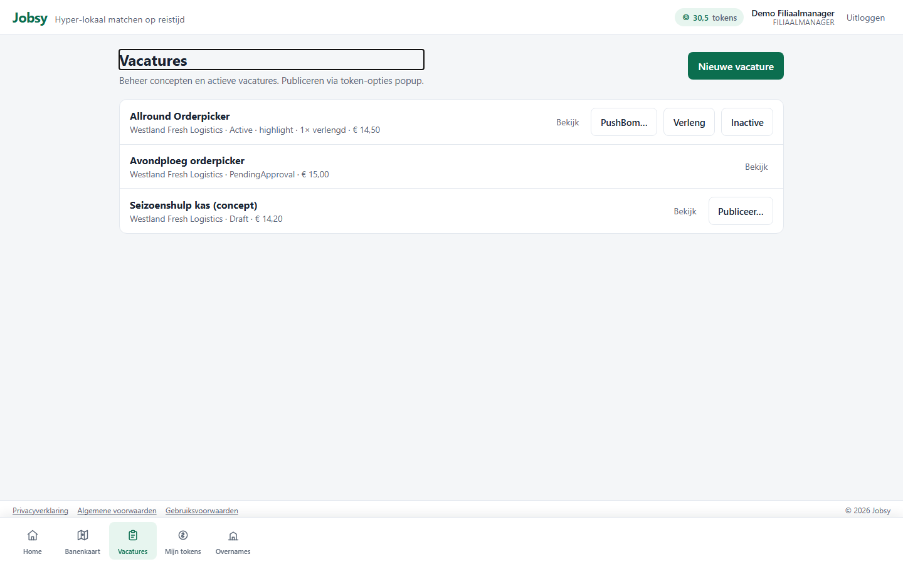
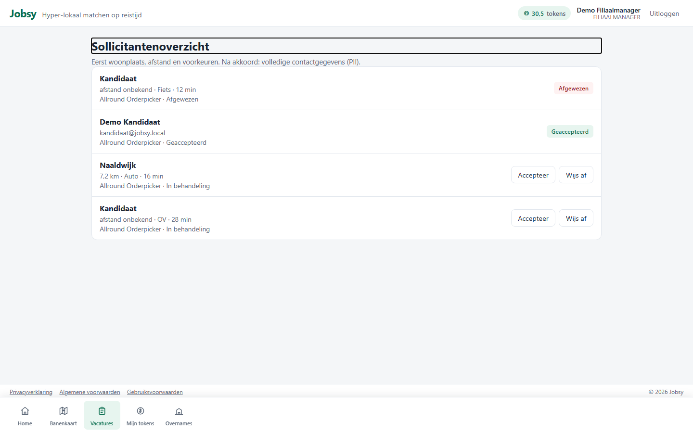
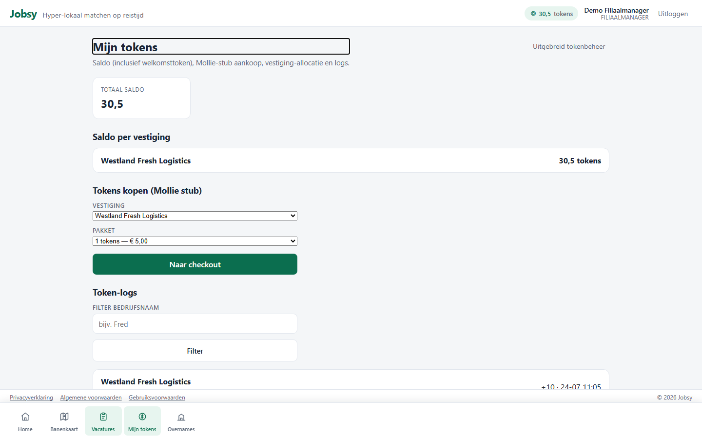

# Rol: Filiaalmanager (BranchManager)

**Account:** `ondernemer@jobsy.local` / `Jobsy123!`  
**Doel:** lokaal werven voor één vestiging — vacatures, tokens, sollicitanten en overnames.

## Werkbeschrijving

De filiaalmanager is de operationele werkgever op vestigingsniveau. Hij publiceert vacatures (basis / highlight / PushBom / verlengen), beheert een **tokenwallet**, bekijkt sollicitanten (PII pas na acceptatie) en ontvangt overnameverzoeken.

Bij onvoldoende tokens gaat publiceren naar `PendingApproval` (Enterprise of Admin keurt goed).

### Kerntaken

| Taak | Waar | Toelichting |
|------|------|-------------|
| Vestiging-KPI’s | `/home` | Vacatures, clicks, sollicitaties, tokens |
| Vacatures beheren / publiceren | `/employer/vacancies` | Publish-opties |
| Nieuwe vacature | `/branch/vacancies/new` | Aanmaken |
| Sollicitanten | `/branch/applicants` | Accept → PII zichtbaar |
| Tokenwallet | `/branch/tokens` | Saldo en logs (aankoop alleen als vestiging zelf tokenbeheer doet) |
| Overnames | `/employer/takeovers` | Inbox |

### Bottom-navigatie

Home · Banenkaart · Vacatures · Mijn tokens · Overnames

### Printscreens

*Vestiging dashboard met KPI’s en tokensaldo in de header.*

*Vacaturebeheer / publiceren.*

*Sollicitantenlijst (privacy: gegevens pas na accept).*

*Tokenwallet en verbruikslogs.*

---

## Demo-script (± 4 min)

1. Log in als `ondernemer@jobsy.local`.  
2. Toon **Home**: vestiging-KPI’s + tokenchip in de header.  
3. Ga naar **Vacatures** → wijs op actieve vacatures en publicatie-opties.  
4. Ga naar **Sollicitanten** → leg uit: gegevens pas na Accept.  
5. Ga naar **Mijn tokens** → saldo / logs (bij centraal tokenbeheer koopt de bedrijfsmanager).  
6. Optioneel: **Overnames** noemen als inbox voor overname van een andere vestiging/organisatie.  
7. Afronden: “Eén vestiging, operationeel werven; tokens via eigen aankoop of via de bedrijfsmanager.”
