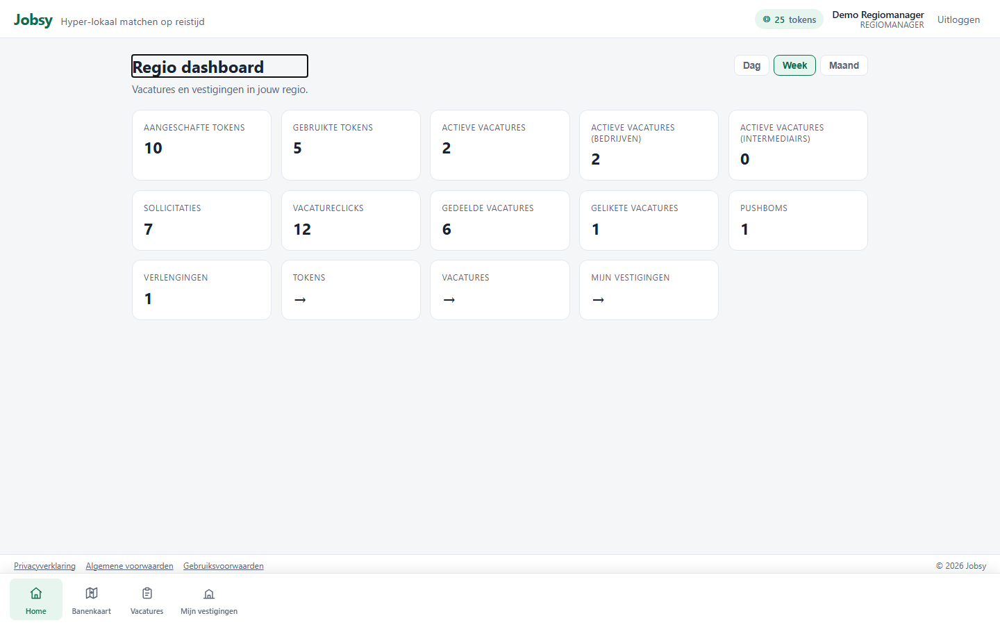
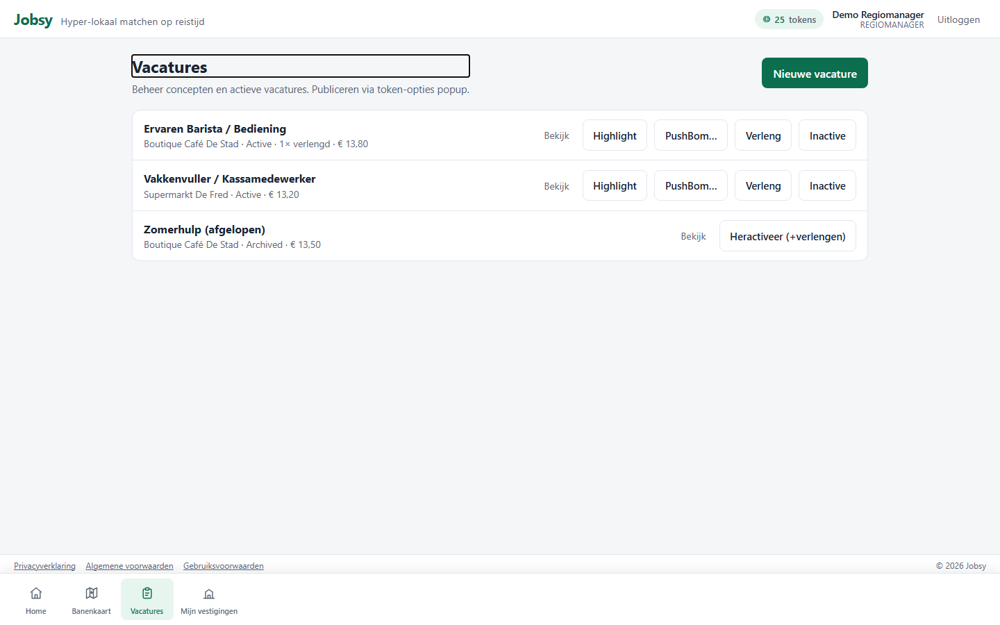
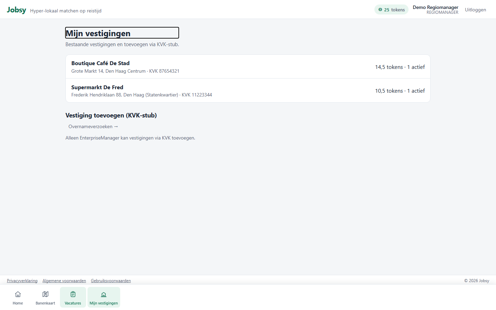

# Rol: Regiomanager (RegionalManager)

**Account:** `regio@jobsy.local` / `Jobsy123!`  
**Doel:** overzicht en sturing over meerdere vestigingen in één regio.

## Werkbeschrijving

De regiomanager zit tussen filiaal en enterprise: regio-KPI’s, vacature-overzicht over vestigingen, en een lijst van vestigingen in de regio. Minder “dagelijks publiceren”, meer **regio-performance**.

### Kerntaken

| Taak | Waar | Toelichting |
|------|------|-------------|
| Regio-KPI’s | `/home` | Aggregatie over vestigingen |
| Vacatures | `/employer/vacancies` | Regio-scope |
| Tokens | `/employer/tokens` | Werkgeverstokens |
| Vestigingen | `/regional/branches` | Overzicht vestigingen |

### Bottom-navigatie

Home · Banenkaart · Vacatures · Mijn vestigingen

### Printscreens

*Regio-dashboard met KPI’s.*

*Vacatures binnen de regio.*

*Lijst vestigingen onder de regio.*

---

## Demo-script (± 2–3 min)

1. Log in als `regio@jobsy.local`.  
2. Toon **Home**: regio-KPI’s (week/maand).  
3. **Vacatures** → overzicht over vestigingen.  
4. **Mijn vestigingen** → welke filialen in de regio vallen.  
5. Contrast met filiaalmanager: “Regio kijkt over vestigingen heen, filiaal werkt lokaal.”
