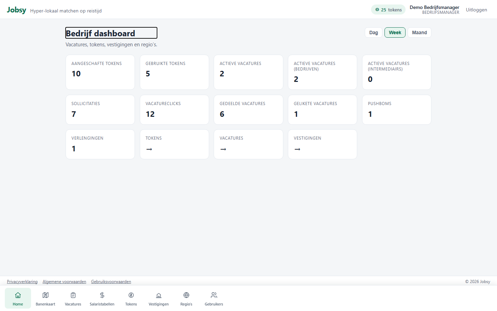
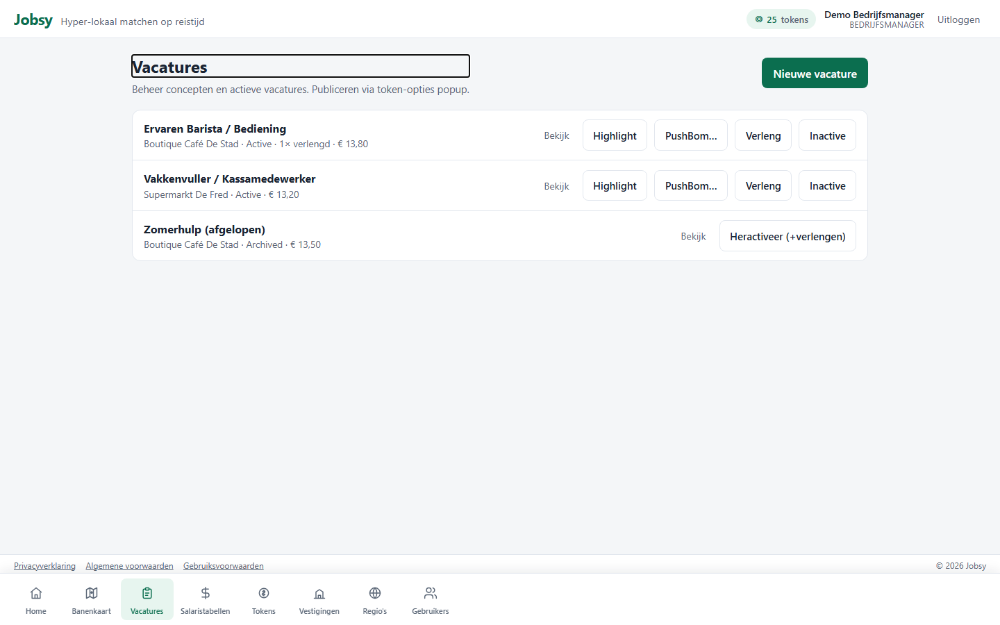
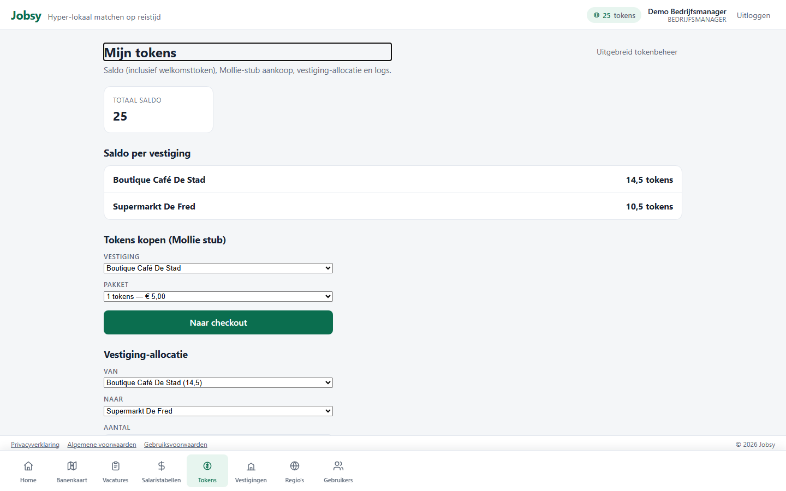
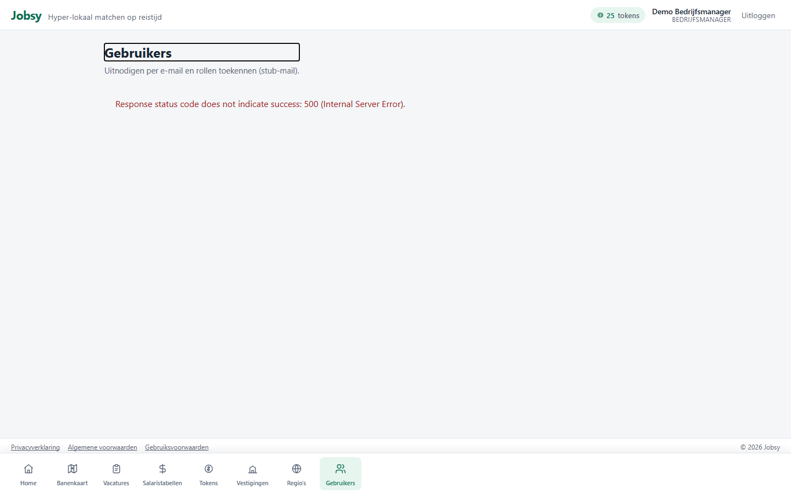
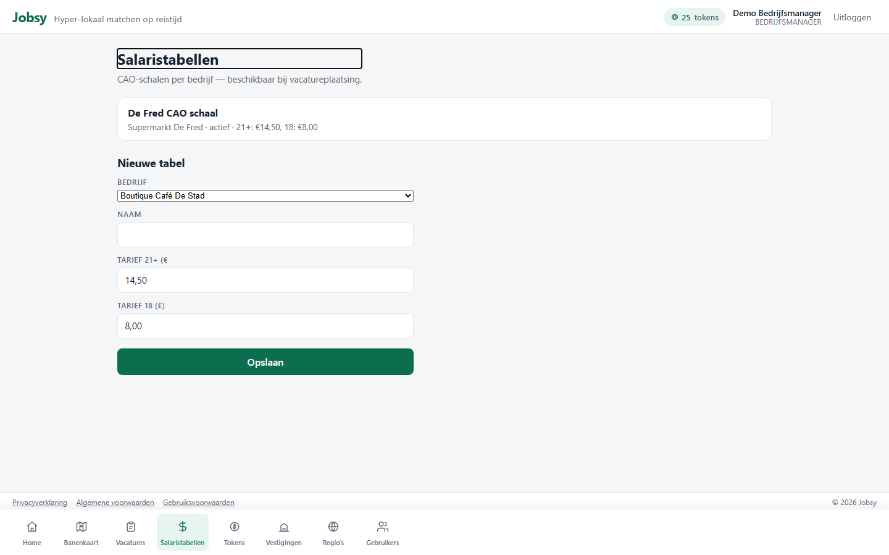

# Rol: Enterprise / Bedrijfsmanager (EnterpriseManager)

**Account:** `enterprise@jobsy.local` / `Jobsy123!`  
**Doel:** organisatiebreed beheer — regio’s, gebruikers, tokens, salaristabellen, goedkeuringen.

## Werkbeschrijving

De enterprise-manager is de centrale beheerder van een organisatie. Naast vacatures en tokens beheert deze rol **vestigingen, regio’s, gebruikers (invite-by-email)**, **CAO/salaristabellen** en **overnames** (goedkeuren → org-merge). Tokenaankoop loopt via een Mollie-stub.

### Kerntaken

| Taak | Waar | Toelichting |
|------|------|-------------|
| Bedrijfs-KPI’s | `/home` | Organisatiebrede metrics |
| Vacatures + approve-publish | `/employer/vacancies` | Ook goedkeuren bij te weinig tokens |
| Tokens kopen / uitgeven | `/employer/tokens` | Pot-aankoop, vestiging aanvinken, uitgifte |
| Vestigingen / regio’s | `/employer/branches`, `/employer/regions` | Structuur |
| Gebruikers | `/employer/users` | Uitnodigen + rollen |
| Salaristabellen | `/employer/salary-tables` | CAO/schalen voor vacatures |
| Overnames | `/employer/takeovers` | Approve / reject |

### Bottom-navigatie

Home · Banenkaart · Vacatures · Salaristabellen · Tokens · Vestigingen · Regio’s · Gebruikers

### Printscreens

*Bedrijfsdashboard.*

*Vacaturebeheer inclusief goedkeuren publicatie.*

*Tokenaankoop in de pot, uitgifte aan vestigingen en logs.*

*Gebruikers uitnodigen en rollen toewijzen.*

*CAO / salarisschalen.*

---

## Demo-script (± 4–5 min)

1. Log in als `enterprise@jobsy.local`.  
2. **Home**: organisatie-KPI’s.  
3. **Tokens**: aankoop in de organisatiopot (radio-pakketten) + uitgifte naar aangevinkte vestigingen.  
4. **Gebruikers**: invite-by-email / rollen.  
5. **Salaristabellen**: koppeling aan vacatures (CAO).  
6. **Vacatures**: approve-publish wanneer een filiaal te weinig tokens heeft.  
7. Afronden: “Enterprise is de control tower van de organisatie.”
