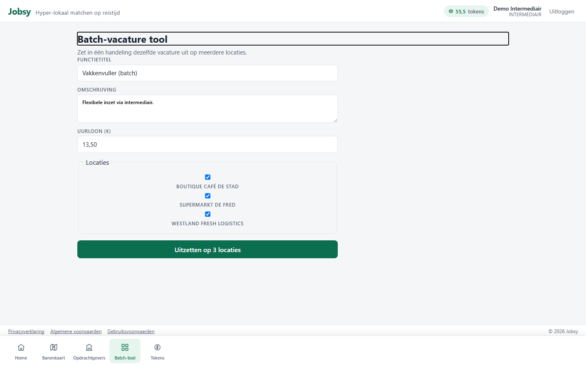
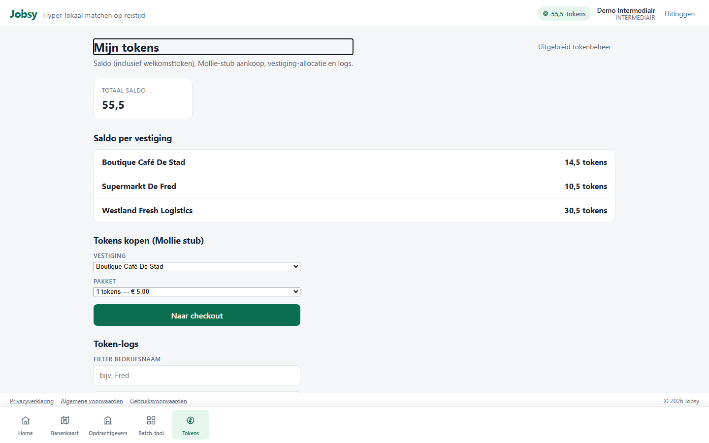

# Rol: Intermediair

**Account:** `intermediair@jobsy.local` / `Jobsy123!`  
**Doel:** batch-hiring voor meerdere opdrachtgevers / client-bedrijven.

## Werkbeschrijving

De intermediair werft niet voor één eigen vestiging, maar voor **gekoppelde opdrachtgevers**. Kern is de batch-tool: multi-locatie publicatie vanuit één flow, met een gedeelde tokenwallet.

### Kerntaken

| Taak | Waar | Toelichting |
|------|------|-------------|
| KPI-dashboard | `/home` | Activiteit over gekoppelde bedrijven |
| Opdrachtgevers | `/intermediary` | Overzicht client-bedrijven |
| Batch publiceren | `/intermediary/batch` | Multi-locatie in één keer |
| Tokens | `/employer/tokens` | Gedeelde wallet |

### Bottom-navigatie

Home · Banenkaart · Opdrachtgevers · Batch-tool · Tokens

### Printscreens

*Dashboard intermediair.*

*Gekoppelde opdrachtgevers.*

*Batch / multi-locatie publicatie.*

*Gedeelde tokenwallet.*

---

## Demo-script (± 3 min)

1. Log in als `intermediair@jobsy.local`.  
2. **Home**: KPI’s over opdrachtgevers.  
3. **Opdrachtgevers**: welke client-bedrijven gekoppeld zijn.  
4. **Batch-tool**: “één flow, meerdere locaties”.  
5. **Tokens**: gedeelde wallet.  
6. Contrast: “Filiaal = één vestiging; intermediair = veel opdrachtgevers.”
