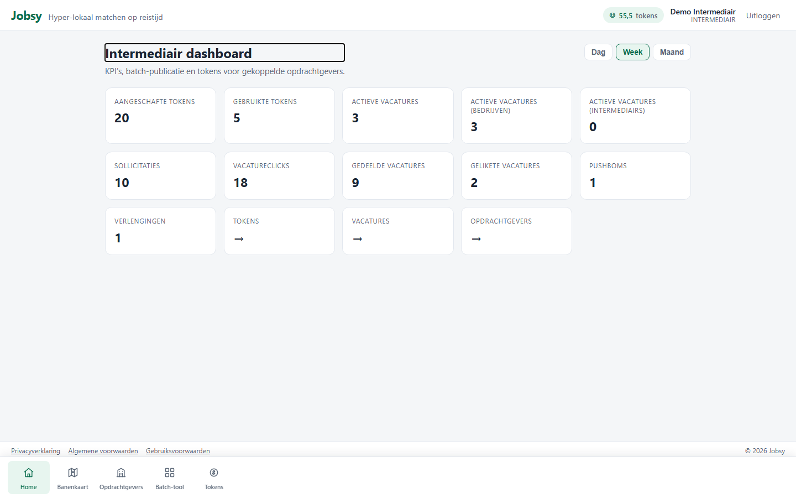
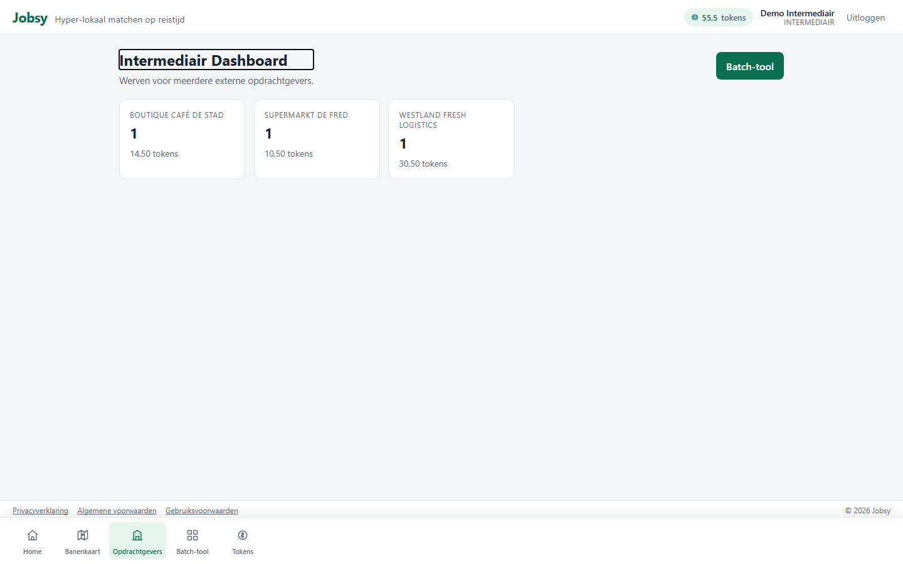

# Rol: Intermediair (Intermediary)

**Account:** `intermediary@jobsy.local` / `Jobsy123!`  
**Doel:** werven voor meerdere opdrachtgevers / client-bedrijven.

## Werkbeschrijving

De intermediair werft niet voor één eigen vestiging, maar voor **gekoppelde opdrachtgevers**. Kern is het opdrachtgeversoverzicht plus vacature- en tokenbeheer per client.

### Kerntaken

| Taak | Waar | Toelichting |
|------|------|-------------|
| KPI-dashboard | `/home` | Resultaten over gekoppelde opdrachtgevers |
| Opdrachtgevers | `/intermediary` | Actieve vacatures en tokens per client |
| Vacatures | `/employer/vacancies` | Publiceren/beheren namens opdrachtgevers |
| Tokens | `/employer/tokens` | Saldo en logs |

### Bottom-navigatie

Home · Hoe werkt Lobsy · Banenkaart · Vacatures · Opdrachtgevers · Tokens

### Printscreens

*Intermediair dashboard.*

*Gekoppelde opdrachtgevers met vacatures en tokens.*

---

## Demo-script (± 3–4 min)

1. Log in als `intermediary@jobsy.local`.  
2. **Home**: KPI’s over gekoppelde opdrachtgevers.  
3. **Opdrachtgevers**: overzicht per client.  
4. **Vacatures**: publiceren/beheren namens een opdrachtgever.  
5. Afronden: “Intermediair bedient meerdere opdrachtgevers vanuit één account.”
