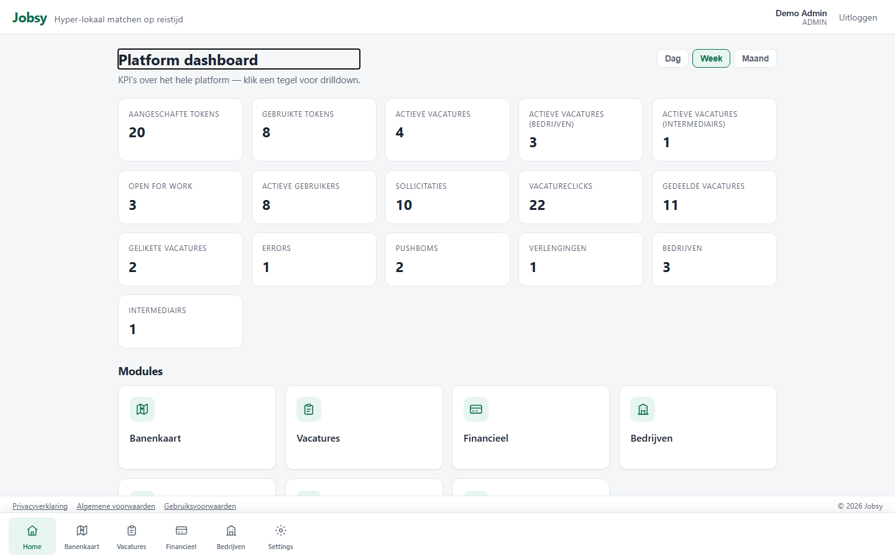
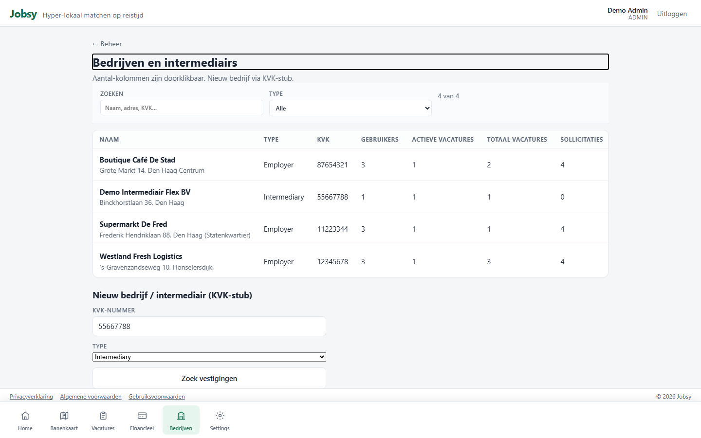
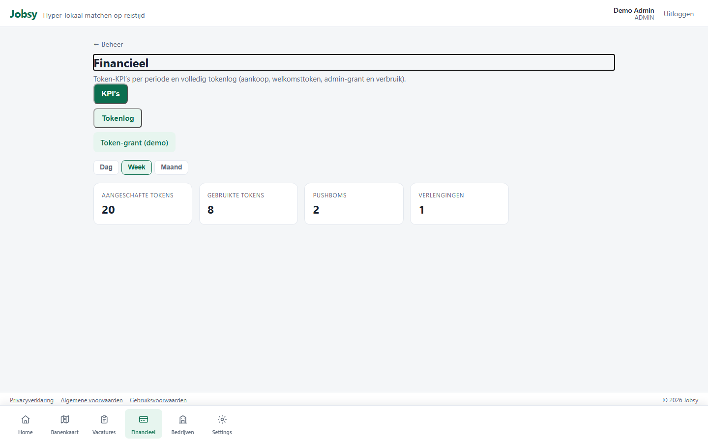
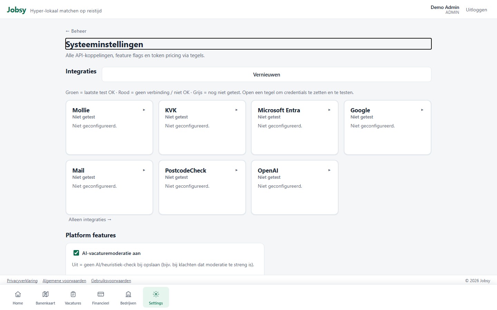
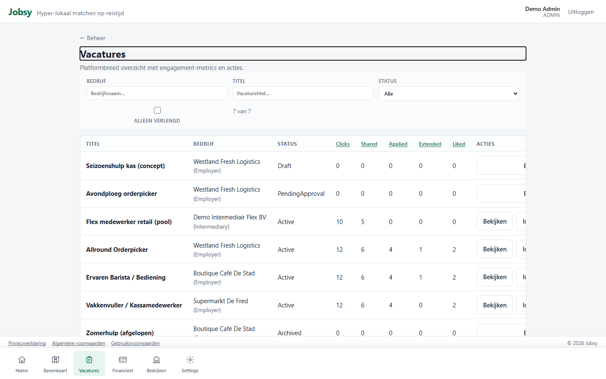

# Rol: Admin

**Account:** `admin@jobsy.local` / `Jobsy123!`  
**Doel:** platformcontrole — bedrijven, finance, WML, settings, logging.

## Werkbeschrijving

De admin beheert het **hele Jobsy-platform**. Naast KPI’s (users, companies, errors, engagement) zijn er modules voor bedrijven, vacatures, finance/token grants, settings (pricing, PushBom, early-adapter), integraties en WML (wettelijk minimumloon).

Placeholders (later): moderatie, masterdata, notificaties.

### Kerntaken

| Taak | Waar | Toelichting |
|------|------|-------------|
| Platform-KPI’s + modules | `/home` | Cockpit |
| Bedrijven | `/admin/companies` | Organisaties op het platform |
| Gebruikers | `/admin/users` | Platformusers |
| Vacatures | `/admin/vacancies` | Cross-company |
| Financieel / tokens | `/admin/finance`, `/admin/tokens` | KPI + grant |
| Settings / integraties | `/admin/settings`, `/admin/integrations` | Pricing, PushBom, pings |
| Logging | `/admin/logging` | Fouten / audit |
| WML | `/admin/wages` | Minimumloon + semi-annual stub |

### Bottom-navigatie

Home · Banenkaart · Vacatures · Financieel · Bedrijven · Settings

### Printscreens

*Platform dashboard met KPI’s en module-tegels.*

*Bedrijvenbeheer.*

*Finance-overzicht.*

*Platformsettings (pricing / PushBom / early-adapter).*

*Alle vacatures op het platform.*

---

## Demo-script (± 3–4 min)

1. Log in als `admin@jobsy.local`.  
2. **Home**: platform-KPI’s (users, companies, errors, tokens) + modules.  
3. **Bedrijven**: welke organisaties actief zijn.  
4. **Financieel** / tokens: platforminkomsten en grants.  
5. **Settings**: pricing / PushBom.  
6. **Vacatures**: cross-company overzicht.  
7. Afronden: “Admin = platform owner; enterprise = één organisatie.”
